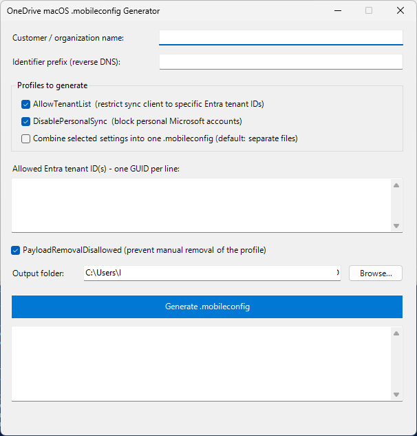

# New-OneDriveMobileConfig.ps1

Offline PowerShell GUI tool that generates Intune-importable `.mobileconfig` profiles for the **macOS OneDrive sync client** (preference domain `com.microsoft.OneDrive`).

Built for MSP use: enter the customer variables once, and the tool produces correctly branded, valid profiles with fresh UUIDs — no manual XML editing per tenant.



## Features

- **AllowTenantList** profile — restricts the OneDrive sync client to one or more approved Entra tenant IDs. Any tenant not on the list is blocked at sign-in.
- **DisablePersonalSync** profile — blocks personal (consumer) Microsoft accounts. Already-configured personal accounts are signed out.
- Generate the two settings as **separate files** (default, independent assignment/rollback in Intune) or as **one combined profile**.
- Fresh `PayloadUUID`s per run (`[guid]::NewGuid()`) — no duplicate-UUID conflicts across customers or re-imports.
- Per-customer branding: `PayloadOrganization`, reverse-DNS `PayloadIdentifier` (auto-suggested from the customer name), display names, and output filenames.
- Input validation: tenant IDs must be valid GUIDs, identifier prefix must be reverse-DNS format.
- XML-safe output: customer names with special characters (`&`, `<`, `"`) are escaped automatically.
- Files are written as **UTF-8 without BOM** — required for clean parsing by Intune and Apple's plist parser.
- Optional `PayloadRemovalDisallowed` toggle.
- 100% offline: no modules, no internet access, no telemetry.

## Requirements

- Windows with PowerShell 5.1 or later (PowerShell 7 on Windows also works)
- No additional modules — uses built-in .NET WinForms

## Usage

```powershell
powershell.exe -ExecutionPolicy Bypass -File .\New-OneDriveMobileConfig.ps1
```

Or right-click the script → **Run with PowerShell**.

### Fields

| Field | Description |
|---|---|
| Customer / organization name | Shown as `PayloadOrganization` on the Mac (System Settings → Profiles) and used in the output filename. |
| Identifier prefix | Reverse-DNS base for `PayloadIdentifier`, e.g. `nl.knmt`. Auto-suggested from the customer name; editable. |
| Profiles to generate | Check AllowTenantList and/or DisablePersonalSync. Optionally combine into one file. |
| Allowed Entra tenant ID(s) | One Directory (tenant) ID GUID per line. Find it in the Entra admin center → Overview, or `(Get-MgOrganization).Id`. |
| PayloadRemovalDisallowed | When enabled, the profile cannot be removed manually on the Mac. |
| Output folder | Where the `.mobileconfig` files are written. Defaults to Desktop. |

### Output

Filenames follow the pattern:

```
OneDrive-AllowTenantList-<Customer>-macOS.mobileconfig
OneDrive-DisablePersonalSync-<Customer>-macOS.mobileconfig
OneDrive-Restrictions-<Customer>-macOS.mobileconfig   (combined mode)
```

## Importing into Intune

1. **Intune admin center** → **Devices → macOS → Configuration profiles**
2. **Create → New policy** → Platform: **macOS** → Profile type: **Templates → Custom** → **Create**
3. **Basics**: name the policy, e.g. `macOS - OneDrive - AllowTenantList - <Customer>`
4. **Configuration settings**:
   - Custom configuration profile name: name shown on the device
   - Deployment channel: **Device channel** (the profiles use `PayloadScope: System`)
   - Upload the `.mobileconfig` file
5. **Assignments**: assign to the target device or user group → **Create**

> ⚠️ The deployment channel cannot be changed after creation. Maximum upload size is 1 MB.

## Verifying on a Mac

After the profile lands (System Settings → General → Device Management):

```bash
defaults read com.microsoft.OneDrive AllowTenantList
defaults read com.microsoft.OneDrive DisablePersonalSync
```

Expected output: the tenant GUID array and `1` respectively. Fully quit and relaunch the OneDrive client (or reboot) — preferences are read at launch.

## Notes & caveats

- **AllowTenantList is a hard allowlist.** Guest/B2B tenants that users sync SharePoint libraries from must also be added, or those libraries will stop syncing.
- These profiles control the **sync client only**. Browser access to other tenants' OneDrive is not affected — that requires Entra tenant restrictions (TRv2) or Defender for Cloud Apps.
- Both profiles write to the same preference domain (`com.microsoft.OneDrive`); macOS merges managed preferences from multiple profiles cleanly, so separate files can be assigned side by side.
- Windows equivalents of these settings: *"Allow syncing OneDrive accounts for only specific organizations"* and *"Prevent users from syncing personal OneDrive accounts"* (Settings Catalog / ADMX).

## Extending

The settings blocks in the script are modular. Additional `com.microsoft.OneDrive` keys can be added the same way, e.g.:

- `KFMSilentOptIn` — silent Known Folder Move (per-tenant, GUID embedded in the key)
- `FilesOnDemandEnabled` — Files On-Demand
- `DefaultFolderLocation` — preset sync folder path
- `OpenAtLogin` — launch OneDrive at login

## Changelog

- **v1.0** — Initial release: AllowTenantList + DisablePersonalSync, separate/combined output, per-customer branding, GUID validation, BOM-less UTF-8 output.
